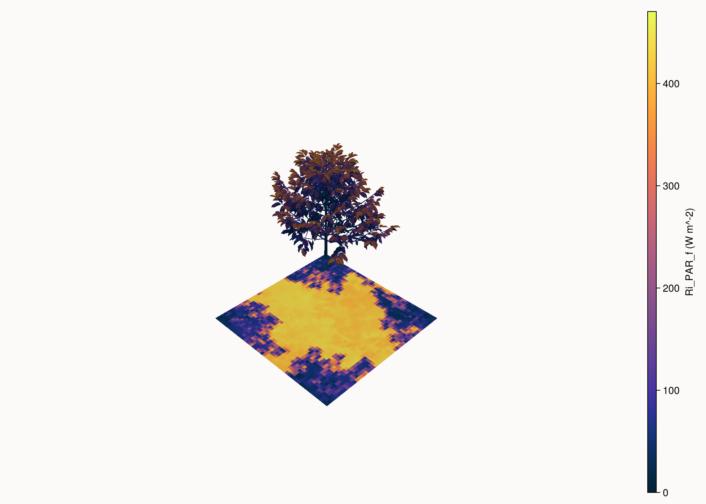

# ArchimedLight.jl

[](https://archimed-platform.github.io/ArchimedLight.jl/stable)
[](https://archimed-platform.github.io/ArchimedLight.jl/dev)
[](https://github.com/VEZY/ArchimedLight.jl/actions/workflows/Test.yml?query=branch%3Amain)
[](https://github.com/VEZY/ArchimedLight.jl/actions/workflows/Docs.yml?query=branch%3Amain)
[](#contributors)
[](https://github.com/JuliaBesties/BestieTemplate.jl)

Julia reimplementation of the ARCHIMED light interception pipeline with a composable, function-first API.



The figure above is generated from the bundled coffee fixture with `scripts/generate_home_figure.jl`. The script loads a scene, models, options, and meteo rows, adds explicit ground geometry, runs one light step, attaches `Ri_PAR_f` onto the MTG, and then renders the colored scene with `plantviz(..., color=:Ri_PAR_f)`.

## Current scope
- Scene/model/meteo input pipeline
- Sky + turtle discretization
- First-order interception (CPU raster/z-buffer)
- Iterative scattering (CPU reference)
- Julia-native fixture regression harness (numeric + visual references)

Energy balance, transpiration and photosynthesis are intentionally out of scope for now.

## Core API
```julia
using ArchimedLight

sim, meteo = read_simulation("config.yml")

summarize_scene(sim.scene; models=sim.models)
summarize_meteo(meteo; options=sim.options)

step = run_light(sim, first(meteo))
series = run_light(sim, meteo)
```

`LightSimulation` owns the prepared scene and optional radiation cache. If a host model changes
the scene, update it explicitly:

```julia
update_scene!(sim, new_scene)
step = run_light(sim, next_meteo_row)
```

In Julia code, the result budget is grouped by quantity and waveband:

```julia
step.budget.incident_flux.total.par
step.budget.incident_energy.total.par
step.budget.absorbed_flux.total.nir
step.budget.absorbed_energy.initial.par
```

File exports and attached MTG attributes keep the ARCHIMED names:
- `Ri_*`: incident light
- `Ra_*`: absorbed light
- `*_f`: irradiance (`W m^-2`)
- `*_q`: per-component energy per timestep (`J`)

Band coefficients come from the model definition when present. If a model omits one band in
`optical_properties`, the runtime falls back to the global option for that band:
- `PAR` fallback: `LightOptions(scattering_coeff_par=...)`
- `NIR` fallback: `LightOptions(scattering_coeff_nir=...)`

With the default options, that means:
- missing model `PAR` coefficient falls back to `0.15`
- missing model `NIR` coefficient falls back to `0.30`
- the corresponding default absorptances used in the final budget are `1 - coeff`

## Interactive inputs

You can also build everything in Julia:

```julia
using ArchimedLight
using PlantGeom
using FileIO, MeshIO

sensor_mesh = load("sensor.obj")

scene = make_scene(domain=(-1.0, -1.0, 1.0, 1.0)) do s
    add_plant!(s, "plant.opf"; group="coffee", id=1, at=(0.0, 0.0, 0.0), rotate=(z=25.0,), deg=true)
    add_object!(s, sensor_mesh; group="sensor", type="panel", id=10, at=(0.5, 0.0, 1.2), scale=0.1)
    add_ground!(s; group="soil", type="ground", nx=20, ny=20)
end

models = models_for(
    "coffee" => (
        "Leaf" => translucent(par=0.15, nir=0.90),
        "Stem" => translucent(par=0.20, nir=0.50),
    ),
    "soil" => (
        "ground" => translucent(par=0.10, nir=0.40),
    ),
)

sim = LightSimulation(scene, models; options=LightOptions())
step = run_light(sim, meteo_row)
```

## Advanced pipeline

The explicit stages remain available for debugging, parity work, and custom research workflows:

```julia
sky = ArchimedLight.compute_sky(row, options)
turtle = ArchimedLight.build_turtle(options, sky)
fluxes = ArchimedLight.compute_directional_fluxes(row, sky, turtle, options)
first_order = ArchimedLight.compute_first_order(scene, models, turtle, fluxes, options)
scat = ArchimedLight.compute_scattering(scene, models, turtle, first_order, options)
budget = ArchimedLight.integrate_light(scene, models, first_order, scat, options; meteo_row=row)
```

For ordinary simulations prefer `LightSimulation` and `run_light`.

## Full Example
- Self-contained files and script are under `example_1/`.
- Run with:

```bash
julia --project=. example_1/full_featured_example.jl
```

## Stage flexibility
- `read_simulation("config.yml")` is the convenience entrypoint for file-driven workflows and returns `sim, meteo`.
- You can call each stage independently through the module (`ArchimedLight.compute_sky`, `ArchimedLight.build_turtle`, `ArchimedLight.compute_first_order`, `ArchimedLight.compute_scattering`, `ArchimedLight.integrate_light`, ...).
- File-based and in-memory workflows share the same runtime path: `read_scene(...)`, `PlantGeom.prepare_scene(...)`, and `PlantGeom.make_scene(...)` all produce `PlantGeom.SceneGeometry`, while `read_models(...)`, `prepare_models(...)`, and `models_for(...)` produce `LightModels`.
- `compute_sky` follows the ARCHIMED clearness/global conversion and DeJong hourly direct/diffuse partitioning.
- `compute_sky` uses substep-weighted sun position (`radiation_timestep`) when sun angles are not provided.
- Meteo `#' use: ...` consistency checks for `clearness`/`RI_SW_f`/`RI_PAR_f`/`RI_NIR_f` are enforced like Java.
- `compute_first_order(...; backend=:raster_cpu)` is the current reference backend (`RasterCPUBackend()` also available).
- `compute_scattering(...; mode=:raycast)` / `compute_scattering(...; mode=:links)` expose the two supported scattering modes; backend objects are also available (`RaycastScatteringBackend()`, `LinksScatteringBackend()`).
- `pixel_size` is validated with ARCHIMED-compatible bounds (`0 < pixel_size <= 0.5` meters).
- `cache_pixel_table=true` enables an on-disk direction projection cache under the interception cache directory.
- `build_turtle` follows the canonical ARCHIMED sector counts `1, 6, 16, 46, 136, 406`.
- `PlantGeom.add_ground!(scene; ...)` is an explicit scene-editing step, so inspectable ground is ordinary geometry in the exported MTG.
- Virtual sensors are declared on the interception model (`sensor=true`, or legacy `model: VirtualSensor` in YAML). They receive light but stay transparent and non-absorbing in the simulation.

## Testing
Run the default fast suite:

```bash
julia --project=test test/runtests.jl
```

This runs the standalone `@testitem`s discovered from the `*-test.jl` files under `test/`,
excluding the `:release`-tagged heavy regression item.

Run only tests with the `:fast` tag directly:

```bash
julia --project=test -e 'using TestItemRunner; TestItemRunner.run_tests("test"; filter=ti -> :fast in ti.tags, verbose=true)'
```

Run one tagged synthetic case directly:

```bash
julia --project=test -e 'using TestItemRunner; TestItemRunner.run_tests("test"; filter=ti -> :single_plate_direct in ti.tags, verbose=true)'
```

Run one tagged fast fixture directly:

```bash
julia --project=test -e 'using TestItemRunner; TestItemRunner.run_tests("test"; filter=ti -> :simpleplant_16_toric in ti.tags, verbose=true)'
```

Run the opt-in regression matrix against frozen Julia baselines:

```bash
julia --project=test test/regression_matrix/runtests.jl
```

Useful regression-matrix controls:

```bash
# refresh in-repo baselines intentionally
ARCHIMEDLIGHT_REGRESSION_UPDATE=true julia --project=test test/regression_matrix/runtests.jl

# write reports somewhere else
ARCHIMEDLIGHT_REGRESSION_REPORT_DIR=/tmp/archimedlight-regression \
julia --project=test test/regression_matrix/runtests.jl
```

`ARCHIMEDLIGHT_REGRESSION_FILTER` accepts a comma-separated list of exact case ids from
`regression_report.csv`.

The regression harness writes a machine-readable CSV report at
`test/regression_matrix/reports/latest/regression_report.csv` by default and stores frozen
fast-profile baselines under `test/regression_matrix/baselines/`.

The dedicated synthetic cases are defined in `test/synthetic-scenes-test.jl`. Current case names include:
`single_plate_direct`, `stacked_scattering`, `toricity_wraparound`,
`virtual_sensor_transparency`, `run_light_step_matches_staged`,
`cache_radiation_parity`, `cached_scattering_series_parity`, and `missing_models`.

Fast fixture inputs/references are under `test/fast_fixtures/` and are intended to be readable
as usage examples.

Generate or refresh fast fixture references (simple-plant numeric CSV + image):

```bash
julia --project=. scripts/generate_fast_fixture_references.jl
```

## Release-only heavy regression (artifact)

Heavy full-fixture regression can be kept outside the package repository and run only before
releases.

Build a data-only artifact tarball from a heavy fixture dataset checkout (fixtures + references +
reference images + manifest):

```bash
julia --project=. scripts/build_release_fixture_artifact.jl \
  --test-root /path/to/heavy-test-root \
  --tarball /tmp/archimedlight-release-fixtures.tar.gz
```

If you want the current Julia outputs to become the packaged references first, refresh and package
in one step:

```bash
julia --project=. scripts/build_release_fixture_artifact.jl \
  --test-root /path/to/heavy-test-root \
  --tarball /tmp/archimedlight-release-fixtures.tar.gz \
  --refresh-references
```

Optional: bind the artifact in `Artifacts.toml` by providing the download URL:

```bash
julia --project=. scripts/build_release_fixture_artifact.jl \
  --test-root /path/to/heavy-test-root \
  --tarball /tmp/archimedlight-release-fixtures.tar.gz \
  --refresh-references \
  --url https://github.com/VEZY/ArchimedLight.jl/releases/download/v0.0.1/archimedlight-release-fixtures-v0.0.1.tar.gz
```

Run release-only heavy regression:

```bash
julia --project=test -e 'using TestItemRunner; TestItemRunner.run_tests("test"; filter=ti -> :release in ti.tags, verbose=true)'
```

You can also bypass artifacts and point directly to a local extracted release dataset:

```bash
ARCHIMEDLIGHT_RELEASE_FIXTURES_DIR=/path/to/release-fixtures \
julia --project=test -e 'using TestItemRunner; TestItemRunner.run_tests("test"; filter=ti -> :release in ti.tags, verbose=true)'
```

Run one release fixture directly by tag. Fixture ids are exposed as tags with `-` replaced by `_`:

```bash
ARCHIMEDLIGHT_RELEASE_FIXTURES_DIR=/path/to/release-fixtures \
julia --project=test -e 'using TestItemRunner; TestItemRunner.run_tests("test"; filter=ti -> :test_compare_simpleplant in ti.tags, verbose=true)'
```

Release test scripts are local in this repository (`test/release/`) and consume only data from the
artifact/dataset. During release runs, per-fixture progress is logged with start/end timestamps.

The regression matrix also has an optional release profile that reuses the same dataset root:

```bash
ARCHIMEDLIGHT_REGRESSION_PROFILE=release \
ARCHIMEDLIGHT_RELEASE_FIXTURES_DIR=/path/to/release-fixtures \
julia --project=test test/regression_matrix/runtests.jl
```

## Benchmarks

The repository includes a separate benchmark project for `AirspeedVelocity.jl` under
`benchmark/`.

## How to Cite

If you use ArchimedLight.jl in your work, please cite using the reference given in [CITATION.cff](https://github.com/VEZY/ArchimedLight.jl/blob/main/CITATION.cff).

---

### Contributors

<!-- ALL-CONTRIBUTORS-LIST:START - Do not remove or modify this section -->
<!-- prettier-ignore-start -->
<!-- markdownlint-disable -->

<!-- markdownlint-restore -->
<!-- prettier-ignore-end -->

<!-- ALL-CONTRIBUTORS-LIST:END -->
