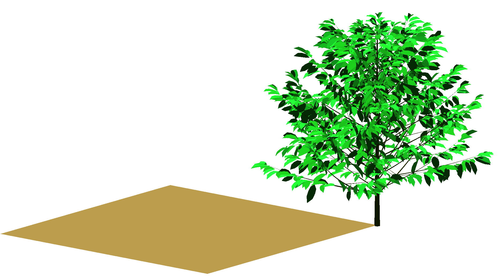

# Getting Started

This page is the shortest path to your first light simulation.
It uses the bundled coffee example from `example_2/`, which is also the source of the image on the home page.



## What This Example Covers

- reading parameters from files, using a `config.yml` as the single source of truth for file paths and model options
- loading a scene from `.ops` and `.opf`
- loading functional-group models from YAML
- reading one meteo step
- running one light step
- attaching `Ri_PAR_f` to the scene for visualization or export

## Minimal Run

From the repository root:

```julia
using ArchimedLight
config =  joinpath(dirname(dirname(pathof(ArchimedLight))), "example_2", "config.yml")
options, scene, meteo, models = read_config(config)
row = first(prepare_meteo(meteo, options).rows)
step = run_light_step(scene, models, row, options)
total_absorbed_par = sum(values(step.budget.absorbed_energy.total.par))
```

The result is a `LightStepResult`. The most useful field at first is `step.budget`, which groups values by:

- quantity: `incident` or `absorbed`
- form: `flux` (`W m^-2`) or `energy` (`J` per component per step)
- stage: `initial` for first-order only, `total` for first-order plus scattering
- waveband: `par`, `nir`, and any extra shortwave bands present in the meteo file

## Attach Results Back Onto The Scene

`ArchimedLight.jl` keeps the numeric results in Julia objects by default. If you want an inspectable scene, attach selected outputs back onto the MTG:

```julia
attach_light_step!(
    scene,
    step;
    fields=[:incident_par_flux, :incident_par_energy, :absorbed_par_energy],
)

write_scene("output/coffee_step.opf", scene)
```

The attached node attributes use the standard ARCHIMED names:

- `:incident_par_flux` -> `Ri_PAR_f`
- `:incident_par_energy` -> `Ri_PAR_q`
- `:absorbed_par_energy` -> `Ra_PAR_q`

## What To Read Next

- [File-Based Workflow](tutorial_files.md) explains how the example directory is organised and how each file contributes to the simulation.
- [Interactive Workflow](tutorial_interactive.md) shows how to build a scene directly in Julia and run light on it without `.ops` / `.opf` input files.
- [Configuration And Options Reference](reference_config.md) lists the configuration keys that the current Julia package actually uses.

## One Important Difference From The Historical Java App

The coffee example still contains several Java-era keys related to outputs, photosynthesis, and energy balance. `ArchimedLight.jl` keeps reading the light configuration and the input file paths, but the package documented here is currently the light-only core. For current behavior, prefer the reference pages on this site over older Java screenshots or YAML examples.
