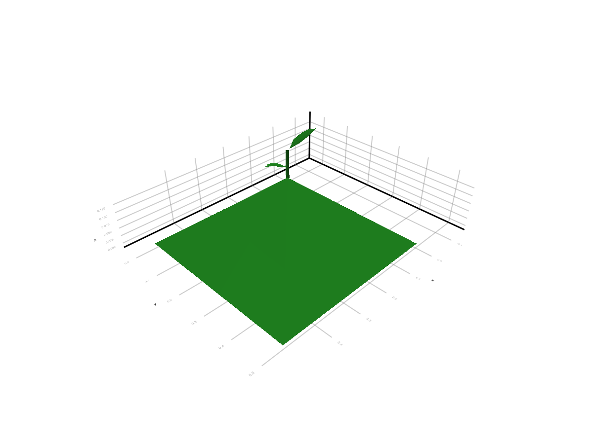
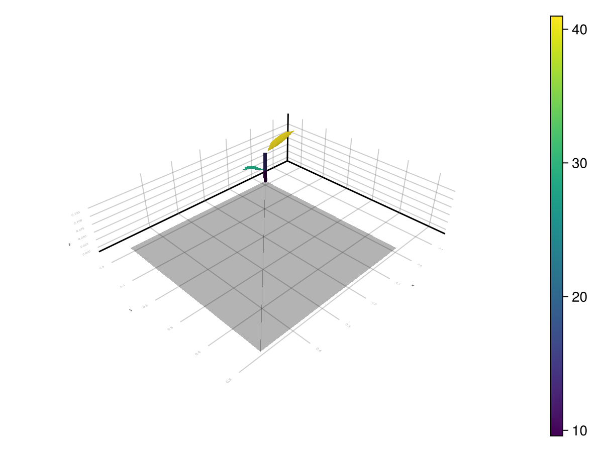

# Outputs

The current Julia package exposes light results in three increasingly concrete forms:

1. in memory as `LightBudget`
2. attached back onto MTG nodes as ARCHIMED-style attributes
3. written to disk when you export the enriched scene

This page documents those three layers and then explains the ARCHIMED-style CSV outputs that still appear in the examples and regression harness.

## 1. In-Memory Outputs: `LightBudget`

The core output of `run_light` for one meteo row is:

```@example outputs
using ArchimedLight

repo_root = normpath(joinpath(dirname(pathof(ArchimedLight)), ".."))
config = joinpath(repo_root, "example_2", "config.yml")
sim, meteo = read_simulation(config)
sky_options = LightOptions(sim.options; include_sky_fraction=true)
sim = LightSimulation(sim.scene, sim.models; options=sky_options)
row = first(meteo)
step = run_light(sim, row)
budget = step.budget;
```

The main grouped fields are:

- `budget.incident_flux`
- `budget.incident_energy`
- `budget.absorbed_flux`
- `budget.absorbed_energy`

Each one is then split into:

- `initial`: first-order interception only
- `total`: first-order plus scattering

and by waveband, for example:

- `par`
- `nir`

Typical accesses:

```@example outputs
budget.incident_flux.initial.par;
budget.incident_flux.total.par;
budget.absorbed_energy.total.nir;
```

Each leaf of that structure is a dictionary keyed by node id.

For artificial emitters, `step.first_order.emitter_escaped_power.par` and
`.nir` report emitted power which left the represented scene without a
geometric hit. These dictionaries are keyed by emitting source node. Together
with emitter-contributed incident power, they provide the explicit
received-plus-escaped power closure (in `W`) described in
[Artificial Light Emitters](theory_scattering.md#artificial-light-emitters).
Virtual sensors are non-consuming observations: their reported incident power
is not subtracted from the ray and is excluded from this physical
received-plus-escaped closure. A sensor may therefore report the same ray that
is subsequently received by a physical component or escapes the scene.
`first_order.incident_power` combines artificial emitters with sky and sun
sources. To verify the closure from public fields, external sky/sun input must
be zero and incident power must be summed over physical (non-sensor) receivers;
sensor entries are observations, not consumed power. The emitter transfer is
accounted separately before it is merged into total incident power.
`emitter_escaped_power` exposes instantaneous PAR and NIR power. The integrated
step budget exposes every emitted band, including custom bands, through
`step.budget.emitter_escaped_energy_per_band[band]`. For PAR and NIR this is the
corresponding escaped power multiplied by the step duration in seconds.

If you need canopy-view metadata for coupled models, `step.sky_fraction` stores
the per-node visible-sky fraction when `options.include_sky_fraction=true`.
When using a YAML config, `read_options` enables that option when
`component_variables.sky_fraction` or `opf_variables.sky_fraction` is `true`.

## 2. Attached Outputs: ARCHIMED Attribute Names

The convenience layer for visual inspection is `attach_light_step!`:

```@example outputs
attach_light_step!(
    sim.scene,
    step;
    fields=[:incident_par_flux, :incident_par_energy, :absorbed_par_energy],
);
```

The default mappings are:

| Field selector | Attached attribute |
| --- | --- |
| `:area` | `area` |
| `:incident_par_initial_flux` | `Ri_PAR_0_f` |
| `:incident_nir_initial_flux` | `Ri_NIR_0_f` |
| `:incident_par_flux` | `Ri_PAR_f` |
| `:incident_nir_flux` | `Ri_NIR_f` |
| `:incident_par_initial_energy` | `Ri_PAR_0_q` |
| `:incident_nir_initial_energy` | `Ri_NIR_0_q` |
| `:incident_par_energy` | `Ri_PAR_q` |
| `:incident_nir_energy` | `Ri_NIR_q` |
| `:absorbed_par_initial_flux` | `Ra_PAR_0_f` |
| `:absorbed_nir_initial_flux` | `Ra_NIR_0_f` |
| `:absorbed_par_flux` | `Ra_PAR_f` |
| `:absorbed_nir_flux` | `Ra_NIR_f` |
| `:absorbed_par_initial_energy` | `Ra_PAR_0_q` |
| `:absorbed_nir_initial_energy` | `Ra_NIR_0_q` |
| `:absorbed_par_energy` | `Ra_PAR_q` |
| `:absorbed_nir_energy` | `Ra_NIR_q` |
| `:sky_fraction` | `sky_fraction` |

The meaning follows the historical ARCHIMED naming:

- `area`: prepared object surface area in `m^2`
- `Ri`: intercepted radiation
- `Ra`: absorbed radiation
- `_0_`: first-order only
- no `_0_`: after scattering has been added
- `_f`: irradiance-like quantity in `W m^-2`
- `_q`: energy per component and per step in `J`

You can also rename attached attributes for downstream packages. For example,
PlantBiophysics can use `Ra_SW_f` as an alias for absorbed NIR:

```@example outputs
attach_light_step!(
    sim.scene,
    step;
    fields=[:area, :absorbed_par_flux, :absorbed_nir_flux, :sky_fraction],
    names=Dict(:absorbed_nir_flux => :Ra_SW_f),
);
```

## 3. Disk Outputs: Exported Scenes

Once results are attached, you can export the enriched scene:

```@example outputs
scene_path = joinpath(mktempdir(), "scene_with_light.opf")
write_scene(scene_path, sim.scene)
isfile(scene_path)
```

Supported export formats are:

- `.ops`
- `.opf`
- `.gwa`

The export path determines the format.

This is currently the main disk output mechanism of `ArchimedLight.jl`: attach node attributes, then write the scene back out.

## Example Output Images





## ARCHIMED-Style CSV Tables

You will still see files such as:

- `component_values.csv`
- `scene_values.csv`
- `summary.csv`

in:

- the archived Java outputs
- the example comparison folder
- the regression and release harnesses under `test/`

Those files remain valuable because they are the main parity targets against the historical implementation.

### `component_values.csv`

Component-scale outputs, typically one row per scene node and step.
Common columns are:

- `step_number`
- `object_id`
- `source_topology_id`
- `group`
- `type`
- `area`
- `Ri_*`
- `Ra_*`

You can write this table from already-computed results:

```@example outputs
series = run_light(sim, meteo)
component_path = joinpath(mktempdir(), "component_values.csv")
write_component_values(component_path, sim, series)
isfile(component_path)
```

`step_index_base=0` is available for compatibility with historical harness
outputs.

### `scene_values.csv`

Scene-scale summary per meteo step.

### `summary.csv`

Grouped aggregation, usually by item, group, and type.

## Which Output Form Should You Use

- use `LightBudget` when staying inside Julia
- use `attach_light_step!` when you want visual inspection or downstream scene export
- use the ARCHIMED-style CSVs when doing parity work with historical datasets or harnesses
