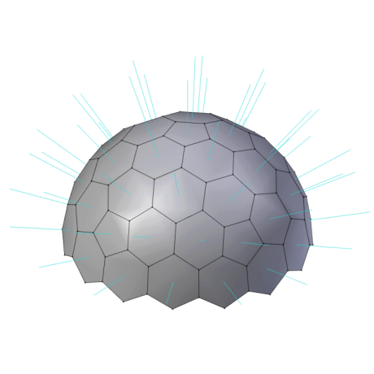
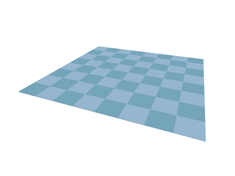
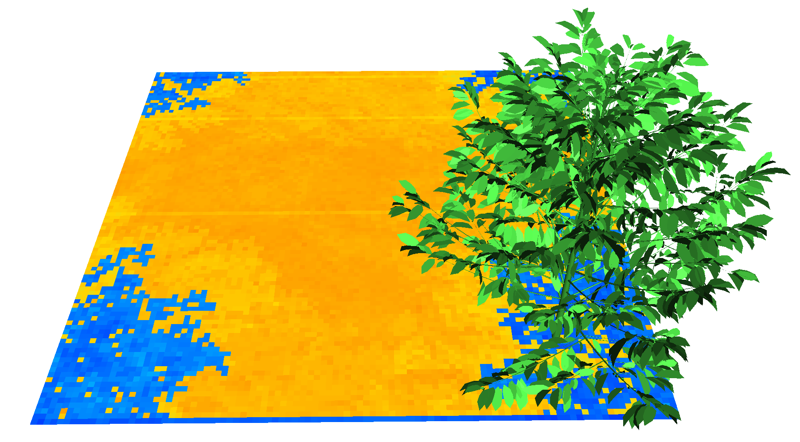
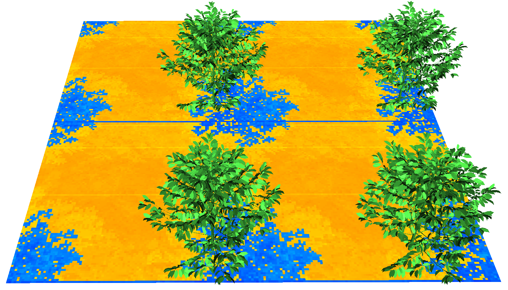

# Configuration And Options Reference

This page documents the top-level `config.yml` structure and the light options that the current Julia package actually reads.

The best mental model is:

- `config.yml` wires files together and defines global runtime options
- scene-specific structure lives in `.ops` / `.opf` / `.gwa`
- component optical properties live in the model YAML files
- time-varying forcing lives in `meteo.csv`

## Top-Level Keys

The current `read_config(path)` entry point reads these top-level keys directly:

```yaml
scene: scene/coffee.ops
models:
  - models/plant_coffee.yml
  - models/soil.yml
meteo: meteo.csv

sky_sectors: 16
all_in_turtle: false
radiation_timestep: 15
scattering: true
pixel_size: 1
area_ratio: true
toricity: true
cache_pixel_table: false
cache_radiation: false
scattering_max_iter: 20
scattering_stop_ratio: 0.01
scattering_coeff_par: 0.15
scattering_coeff_nir: 0.30
nir_interception: true
nir_scattering: true
java_logged_turtle_dirs: false
meteo_range: 2, 3
debug: false
log_debug: false
```

## Required Keys

- `scene`: path to an `.ops`, `.opf`, or `.gwa` scene source
- `models`: list of model YAML files, or a config file that itself contains such a list
- `meteo`: path to the meteo CSV

Without those three keys, `read_config` cannot assemble the simulation inputs.

## Option Reference

### `sky_sectors`

Number of turtle sectors used to discretize the sky hemisphere.
Supported counts are the historical ARCHIMED values:

- `1`
- `6`
- `16`
- `46`
- `136`
- `406`

More sectors improve angular resolution but increase runtime.



### `all_in_turtle`

Controls how direct light is represented:

- `false`: keep the direct beam as its own explicit sun direction
- `true`: redistribute direct light into turtle sectors near the sun direction

Keeping the sun explicit is usually the clearer default. Folding it into the turtle is historically useful for compatibility and can be faster.

### `radiation_timestep`

Maximum duration, in minutes, of the radiative substeps used inside a meteo interval.
This is one of the key ARCHIMED ideas: the meteo time step and the radiative integration substep are not the same thing.

If a meteo row spans 30 minutes and `radiation_timestep: 5`, the direct beam and sky decomposition are evaluated on smaller substeps and integrated back into one directional forcing state.

### `pixel_size`

Requested pixel size in centimetres in the YAML file.
Internally, `LightOptions.pixel_size` stores the value in meters.

This parameter controls the horizontal sampling density of the projected pixel tables:

- smaller pixels -> more rays and finer spatial resolution
- larger pixels -> fewer rays and faster runs

The current runtime validates `0 < pixel_size <= 0.5` meters after conversion.

### `area_ratio`

Whether to apply the projected-area correction after rasterization.
For ARCHIMED-style parity, this normally stays enabled.

See [First-Order Interception](theory_interception.md) for the geometric reason this correction exists.

### `scattering`

Enable or disable iterative multiple scattering.

- `false`: first-order interception only
- `true`: first-order interception followed by iterative scattering

### `scattering_max_iter`

Hard cap on the number of scattering iterations.

### `scattering_stop_ratio`

Relative stopping threshold for scattering.
The iterative process stops when the scene-scale scattered energy of the current iteration falls below:

```text
scattering_stop_ratio × initial intercepted scene energy
```

The default `0.01` reproduces the historical 1 percent rule.

### `scattering_coeff_par`, `scattering_coeff_nir`

Fallback scattering coefficients used when the relevant model file does not provide `optical_properties` for the corresponding waveband.

The current defaults are:

- PAR: `0.15`
- NIR: `0.30`

Absorptance is derived as `1 - scattering_coefficient` unless more specific per-node information is available.

### `cache_radiation`

Reuse directional light responses across meteo rows.
This is worthwhile when many time steps are simulated on the same scene.

### `cache_pixel_table`

Store projection tables on disk instead of recomputing or keeping them only in memory.
This trades memory for I/O.

### `toricity`

Enable the periodic wrapping of the plot in the horizontal plane.

- `false`: the plot is treated as isolated
- `true`: rays leaving one horizontal edge re-enter on the opposite edge

This is how ARCHIMED represents repeated orchard or crop patterns with a finite representative tile.







### `nir_interception`, `nir_scattering`

Allow you to disable NIR interception or NIR scattering independently when needed for debugging, parity work, or reduced runs.

### `java_logged_turtle_dirs`

Compatibility/debug option for Java-style turtle direction logging.

### `meteo_range`

Restrict the simulated meteo rows.
The historical string forms are still accepted, for example:

```yaml
meteo_range: 2, 5
# or
meteo_range: 2016/07/01 08:00:00, 2016/07/01 12:00:00
```

### `debug`, `log_debug`, `debug_drop_leading_hit`

Low-level parity and debugging options used mainly while chasing differences with the Java implementation.

## Legacy Keys You May Still See

The bundled examples intentionally preserve several historical ARCHIMED keys such as:

- `scene_rotation`
- `photosynthesis`
- `output_directory`
- `simulation_directory`
- `write_summary`
- `export_ops`
- `component_variables`
- `opf_variables`

Those keys remain useful documentation for old workflows, but they are not the main user API of the current light-only Julia package. For actual output pathways in `ArchimedLight.jl`, see [Outputs](outputs.md).

## Recommended Reading Order

- [Scene Files And Semantics](reference_scene.md)
- [Model Files Reference](reference_models.md)
- [Meteo Inputs Reference](reference_meteo.md)

## Interactive Equivalent

There is no one-file interactive equivalent of `config.yml`.

Instead, the information that would normally be centralized in the config file
is passed explicitly as Julia objects and function arguments:

```julia
scene = prepare_scene(mtg; scene_xy_bounds=(-1.0, -1.0, 1.0, 1.0))
models = prepare_models(groups)
meteo = MeteoTable(rows, metadata)
rows = prepare_meteo(meteo, options).rows
step = run_light_step(scene, models, first(rows), options)
```

The correspondences are:

- `scene:` -> the MTG you pass to `prepare_scene`
- `models:` -> the groups you pass to `prepare_models`
- `meteo:` -> the `MeteoTable` or `SkyState` you build in Julia
- global YAML options such as `sky_sectors`, `pixel_size`, `toricity`, `scattering` -> fields of `LightOptions`

For example, this file-based block:

```yaml
sky_sectors: 16
pixel_size: 1
toricity: true
scattering: false
```

becomes:

```julia
options = LightOptions(
    turtle_sectors=16,
    pixel_size=0.01,
    toricity=true,
    scattering=false,
)
```

So `config.yml` is mainly a convenience layer for file-based workflows. In an
interactive workflow, the same information is still required, but you provide it
piece by piece in Julia instead of assembling it in one YAML file.
