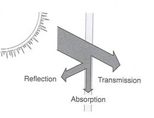

# Model Files Reference

Model files define how ARCHIMED functional groups behave radiatively. In the current Julia package, the part that directly drives the light computation is the `Interception` block. Historical ARCHIMED model files often contain many other process blocks as well, especially for photosynthesis, stomatal conductance, or energy balance, but those sections are archival context rather than active inputs for `ArchimedLight.jl`.

The easiest way to think about a model file is that it answers the question: once a scene component has been identified as belonging to a given functional group and type, how should light interact with it? The file does not describe where the object is in space; that comes from the scene. It describes how transparent it is, how strongly it scatters light, whether it should behave as a virtual sensor, and whether it emits light of its own.

## One File Per Functional Group

Example:

```yaml
---
Group: coffee
Type:
  Metamer:
    Interception:
      model: Translucent
      transparency: 0.1
      optical_properties:
        PAR: 0.15
        NIR: 0.9
  Leaf:
    Interception:
      model: Translucent
      transparency: 0.0
      optical_properties:
        PAR: 0.15
        NIR: 0.9
...
```

The main structure is simple. `Group` gives the functional-group name, which must match the group information coming from the scene, and `Type` maps component type names to their process blocks. In practice, that means one file usually covers one biological or structural group, and then refines behavior organ by organ inside that group.

## Matching Rules

Model matching is driven by the `(group, type)` pair attached to each scene node. The runtime first looks for an exact match, then progressively falls back through wildcard rules until it finds something usable. The precedence is exact group and exact type, then exact group with wildcard type `*`, then wildcard group `*` with exact type, and finally wildcard group with wildcard type.

This fallback system is important because it lets a model file behave like a layered set of defaults. You can write one generic optical model for many synthetic types, then override only the few organs that really need distinct behavior. It also makes incremental modeling easier: users can start with a broad fallback and refine only the components that matter.

## The `Interception` Block

The current light runtime uses these keys:

```yaml
Interception:
  model: Translucent
  transparency: 0.0
  optical_properties:
    PAR: 0.15
    NIR: 0.9
```

### `model`

The standard historical choice is `Translucent`, which is the ordinary interception model for plant and ground components. That tells the runtime to treat the component as something that can intercept light, transmit part of it according to its transparency, and contribute to the scattering budget according to its optical coefficients.

Virtual sensors are declared either with:

```yaml
model: VirtualSensor
```

or

```yaml
sensor: true
```

Virtual sensors receive light, but they stay transparent and non-absorbing in the transfer logic. In other words, they are there to observe the radiative field, not to alter it. That distinction matters when a scene contains diagnostic surfaces or synthetic measurement devices.

### `transparency`

`transparency` is the first-order transmission parameter of the interception model. It controls how much light passes through the component instead of being intercepted at the first encounter. This is not a full optical theory by itself, but it is one of the key ways the model distinguishes a more opaque element from a more transmissive one. For users, the important point is that this parameter affects the immediate interception stage before multiple scattering is considered.

### `optical_properties`

`optical_properties` stores waveband-specific scattering coefficients. For most canopy workflows, the important built-in bands are `PAR` and `NIR`, but the runtime can also carry additional shortwave bands when the meteo input and the model definitions agree on their names.

Example with one custom band:

```yaml
optical_properties:
  PAR: 0.15
  NIR: 0.90
  custom: 0.15
```

The optical coefficient is interpreted as the scattered fraction. During budget integration, absorptance is then derived from it as approximately:

```text
absorptance = 1 - scattering_coefficient
```

when no more specific optical information is available.

This is one of the most important conceptual points in the model files. The `Interception` block does not only say whether a component is hit by light; it also influences what becomes of that intercepted energy afterwards. A higher scattering coefficient means more of the intercepted energy remains available to be redistributed, while a lower coefficient implies more default absorption.



## Multiple Named Variants

Historical ARCHIMED files often store several named parameter sets under one process block and select one with `use`:

```yaml
Interception:
  use: Translucent_1
  Translucent_1:
    model: Translucent
    transparency: 0.0
    optical_properties:
      PAR: 0.15
      NIR: 0.90
  Translucent_2:
    model: Translucent
    transparency: 0.2
    optical_properties:
      PAR: 0.20
      NIR: 0.85
```

`ArchimedLight.jl` preserves that historical pattern. When several named variants are stored under one process block, the `use` field selects which one is active. This is mostly a convenience for model authors: it lets one file keep several parameterizations side by side without duplicating the whole type definition.

## Light Emitters

Emitter blocks are also supported in the type model:

```yaml
LightEmitter:
  model: LambertianEmitter
  radiance: 20.0
  gamma:
    PAR: 0.48
    NIR: 0.52
```

This is useful for artificial light sources, controlled environments, or diagnostic scenes. In most canopy workflows, the dominant forcing still comes from the meteo file, but emitter blocks make it possible to construct scenes where some components contribute radiance directly instead of only intercepting external light.

## Soil And Paving

Ground models are ordinary functional groups, often with a `plot_paving` hint:

```yaml
Group: pavement
Type:
  Cobblestone:
    Interception:
      model: Translucent
      transparency: 0
      optical_properties:
        PAR: 0.15
        NIR: 0.9
    plot_paving: 80
```

The important point is that soil and paving are not special cases from the model point of view. They are just functional groups with their own interception properties. If `read_config` sees a positive `plot_paving` count and the scene does not already contain that ground type, it can materialize paving tiles automatically. That is a convenience feature, but the radiative behavior still comes from the same kind of model file as for any other group.

## What Happens If A Band Is Missing

When a model omits a waveband in `optical_properties`, the runtime falls back to the corresponding global option in `LightOptions`: missing PAR falls back to `options.scattering_coeff_par`, and missing NIR falls back to `options.scattering_coeff_nir`. That is why the global scattering coefficients still matter even in projects where most groups are fully parameterized. They are the safety net for incomplete optical descriptions.

## What Is Ignored By The Current Package

Historical model files may include `Photosynthesis`, `StomatalConductance`, and many energy-balance parameters. Those sections remain useful archival context because they explain how old ARCHIMED workflows were organized, but they are not part of the active light API of `ArchimedLight.jl`. Users reading the file for light behavior should therefore focus mainly on `Interception`, optional emitter definitions, and the group/type structure.

## Interactive Equivalent

In an interactive workflow, you do not need YAML model files. The equivalent is to build [`GroupModel`](@ref), [`TypeModel`](@ref), and [`InterceptionModel`](@ref) objects directly in Julia, then normalize them with `prepare_models`. The same semantics still apply: the runtime is still trying to answer the same model-matching question, only the mapping now comes from Julia objects rather than from files on disk.

Typical pattern:

```julia
models = prepare_models([
    GroupModel(
        "coffee";
        types=OrderedDict(
            "Leaf" => TypeModel(
                interception=InterceptionModel(
                    model="Translucent",
                    transparency=0.0,
                    optical_properties=OpticalProperties(0.15, 0.90),
                ),
            ),
            "Metamer" => TypeModel(
                interception=InterceptionModel(
                    model="Translucent",
                    transparency=0.1,
                    optical_properties=OpticalProperties(0.15, 0.90),
                ),
            ),
        ),
    ),
])
```

The correspondences are direct: YAML `Group:` becomes `GroupModel("coffee"; ...)`, YAML `Type:` entries become the `types=OrderedDict(...)` mapping, the YAML `Interception:` block becomes `InterceptionModel(...)`, and the YAML `LightEmitter:` block becomes `EmitterModel(...)`. The key point is that matching semantics are unchanged. A node still resolves models by its `(group, type)` pair; the only difference is whether that mapping came from YAML files or from Julia objects you assembled yourself.

### Interactive Wildcard Models

The wildcard mechanism also works when models are defined directly in Julia. You can use `*` at the group level with `GroupModel("*"; ...)`, at the type level with `types=OrderedDict("*" => ...)`, or at both levels at once.

The broadest fallback is:

```julia
models = prepare_models([
    GroupModel(
        "*";
        types=OrderedDict(
            "*" => TypeModel(
                interception=InterceptionModel(
                    model="Translucent",
                    transparency=0.0,
                    optical_properties=OpticalProperties(0.15, 0.30),
                ),
            ),
        ),
    ),
])
```

That broad fallback means any functional group can match `GroupModel("*", ...)`, and any component type inside that group can match the `"*"` type entry. This is especially useful for quick synthetic scenes, for tests that should not depend on many exact type names, or for building a safe default before progressively adding more specific overrides.

You can also mix explicit and wildcard rules:

```julia
models = prepare_models([
    GroupModel(
        "coffee";
        types=OrderedDict(
            "Leaf" => TypeModel(
                interception=InterceptionModel(
                    model="Translucent",
                    transparency=0.0,
                    optical_properties=OpticalProperties(0.18, 0.88),
                ),
            ),
            "*" => TypeModel(
                interception=InterceptionModel(
                    model="Translucent",
                    transparency=0.0,
                    optical_properties=OpticalProperties(0.15, 0.90),
                ),
            ),
        ),
    ),
    GroupModel(
        "*";
        types=OrderedDict(
            "*" => TypeModel(
                interception=InterceptionModel(
                    model="Translucent",
                    transparency=0.0,
                    optical_properties=OpticalProperties(0.15, 0.30),
                ),
            ),
        ),
    ),
])
```

With that setup:

- `("coffee", "Leaf")` uses the explicit coffee leaf model
- `("coffee", "Stem")` falls back to the wildcard type inside the coffee group
- `("banana", "Leaf")` falls back to the global wildcard group and wildcard type

The precedence is the same as for YAML model files:

1. exact group and exact type
2. exact group and wildcard type
3. wildcard group and exact type
4. wildcard group and wildcard type
