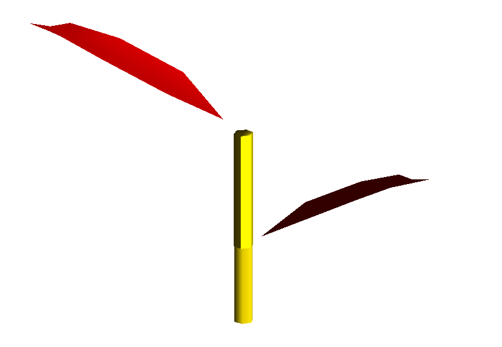

# Scene Files And Semantics

The scene definition is spread across three related concepts: the plot itself, the objects placed in that plot, and the per-component geometry and metadata that let the solver identify what each triangle belongs to. Historically those pieces are distributed across `.ops`, `.opf`, and `.gwa` files, which is why scene descriptions can feel less obvious than the one-file `config.yml` entry point suggests.

The key thing to keep in mind is that the light model does not need a scene file for its own sake. It needs a projection domain, geometry to intersect, and metadata that let each geometric component be matched to a radiative model. The different scene formats are just different ways of supplying that information.

## The Three Entry Formats

`read_scene(path)` accepts `.ops`, `.opf`, and `.gwa`. In practice, `.ops` is the most common entry point because it lets one file define the plot, place several objects in it, and attach them to ARCHIMED functional groups. `.opf` is richer when plant topology matters, and `.gwa` is lighter when geometry alone is enough.

## `.ops`: Plot, Placement, Functional Groups

Example:

```text
# T xmin ymin zmin xmax ymax flat
T 0 0 0 2 2 flat

#[Archimed] coffee

#sceneId objectId FilePath x y z scale inclinationAzimut inclinationAngle rotation
1	1	opf/coffee.opf	0	0	0	0	0	0	0
```

The essential parts are the terrain line `T ...`, which defines the plot bounds used as the projection area, the `#[Archimed] group_name` line, which sets the functional group for the following objects, and the object rows themselves, which provide file paths, placement, and object-level transforms.

### What The Terrain Line Means

Historically, the `.ops` terrain line serves two roles at once. It defines the usable plot, but it also defines the support over which the projected pixel tables are built. That second role is why this line matters so much for light calculations. The plot is not just a visualization box around the plants; it is the horizontal domain on which raster interception is computed. If the terrain line is wrong, the light calculation is not just displayed incorrectly, it is formulated on the wrong support.

### Functional Groups In `.ops`

ARCHIMED introduces a convention on top of the plain `.ops` format:

```text
#[Archimed] coffee
```

Every following object line inherits that functional group until another `#[Archimed] ...` line appears.
Those group names are how scene items are matched to model YAML files. In other words, the `.ops` file is not merely arranging geometry in space; it is also telling the runtime which family of radiative parameters should apply to the objects being placed.

## `.opf`: Plant Topology Plus Geometry

An `.opf` stores reference meshes, visualization materials, attributes attached to topology nodes, and usually a plant topology organized as an MTG-like hierarchy.



For `ArchimedLight.jl`, the most important consequence is that an `.opf` can preserve organ-scale identity. The solver can therefore keep outputs at the component level and attach them back to the corresponding nodes instead of collapsing everything into anonymous geometry. That matters whenever you want inspectable per-organ outputs, stable ids, or links back to the original plant structure.

### What `ArchimedLight.jl` Extracts From The Scene

When you call `read_scene` or `prepare_scene`, the package turns the original scene into a `SceneGeometry`. That runtime object contains one merged mesh for efficient geometric processing, a `face2node` map that links triangles back to component ids, node areas and barycentres, functional group and type metadata, source ids such as `source_topology_id` and `object_id`, and the scene XY bounds. This is the representation actually used by first-order interception and scattering. The original file format matters only insofar as it can be translated into this form without losing the information the solver needs.

## `.gwa`: Geometry Without Plant Topology

A `.gwa` is useful for soil or paving geometry, virtual structures such as walls or support frames, and simple geometric sensors or emitters. Unlike `.opf`, it does not carry a plant topology. That makes it lighter and easier to use for purely geometric objects, but it also means fewer topological semantics are available afterwards. If you only need geometry and metadata, that is fine. If you need plant structure and component identity in a richer sense, `.opf` is usually the better container.

## Scene Metadata That Matter For Light

### Plot Bounds

The solver needs an XY domain for rasterization. With file-based scenes, that comes from the `.ops` terrain line. With in-memory scenes, you provide it explicitly:

```julia
scene = prepare_scene(mtg; scene_xy_bounds=(0.0, 0.0, 2.0, 2.0))
```

### `group`

This is the functional group used to resolve optical models. If the group information is wrong or missing, the geometry may still exist, but the runtime will not know which model parameters should apply to it.

### `type`

The `type` is the component type name inside the functional group. By default, `prepare_scene` derives it from node attributes if present, otherwise from the node symbol. This is what allows a leaf, stem, paving tile, or sensor to inherit different optical behavior even when they belong to the same broader group.

### `object_id`

`object_id` is a higher-level entity id used to regroup component outputs. It is not the main lookup key for model matching, but it is useful when several geometric parts belong to the same plant or object and you want to aggregate or inspect results at that level.

### `source_topology_id`

`source_topology_id` is the stable component id imported from the original source when available. This is valuable whenever you want to trace a runtime result back to the original topology rather than only to the internally prepared scene representation.

## In-Memory Scenes

The same semantics apply if the scene never touches disk:

```julia
scene = prepare_scene(
    mtg;
    source_path="interactive.opf",
    scene_xy_bounds=(-1.0, -1.0, 1.0, 1.0),
)
```

The critical rule is that the MTG nodes carrying geometry must expose enough metadata for model lookup, especially a functional group, typically through `:functional_group`, and a type, either explicit or implied by the node symbol. If those semantics are present, the light runtime does not particularly care whether they came from an `.ops`/`.opf` pair or from Julia code.

### Interactive Equivalent

There is no mandatory scene file in an interactive workflow. The equivalent of the `.ops` + `.opf` information is simply the MTG topology and geometry you build in Julia, the per-node metadata you attach to that MTG, and the explicit `scene_xy_bounds` you pass to `prepare_scene`.

Typical pattern:

```julia
mtg = Node(MutableNodeMTG(:/, :Plant, 1, 1))
leaf = Node(mtg, MutableNodeMTG(:+, :Leaf, 1, 2))
leaf[:geometry] = some_geometry
leaf[:functional_group] = "coffee"
leaf[:object_id] = 1

scene = prepare_scene(
    mtg;
    source_path="interactive.opf",
    scene_xy_bounds=(-1.0, -1.0, 1.0, 1.0),
)
```

The correspondences are straightforward. The `.ops` terrain line becomes `scene_xy_bounds=(xmin, ymin, xmax, ymax)`, the `#[Archimed] coffee` tag becomes something like `node[:functional_group] = "coffee"`, object placement becomes the coordinates or transforms you construct in Julia, and organ identity from `.opf` becomes the MTG nodes you keep in memory. So the interactive question is not really "which file format should I write?" but rather "does my MTG expose geometry, group, type, and plot bounds clearly enough for `prepare_scene`?"

## Ground And Paving

Two mechanisms exist for ground and paving. `read_config` can materialize paving automatically when a model file contains `plot_paving`, and `add_ground!` can add explicit tiles to an already-loaded scene. The choice depends on whether you want a convenience layer or an explicitly inspectable geometric object.

Explicit ground geometry is especially useful when you want inspectable soil outputs, realistic scattering exchanges near the bottom of the canopy, or a final exported scene that really contains the ground elements rather than only implying them.

## Practical Checks Before Running

Before running, it is worth checking a few scene semantics rather than only geometry. Make sure the plot bounds are representative, especially if `toricity=true`, because the projection domain is part of the light model itself. Make sure each simulated node resolves to a valid `(group, type)` model pair, because unmatched geometry is not scientifically meaningful even if it is geometrically valid. Prefer `.opf` when component identity matters and `.gwa` when geometry alone is enough. And if toricity is enabled, keep the scene footprint consistent with the real repeated pattern, otherwise the model will repeat the wrong tile forever.
