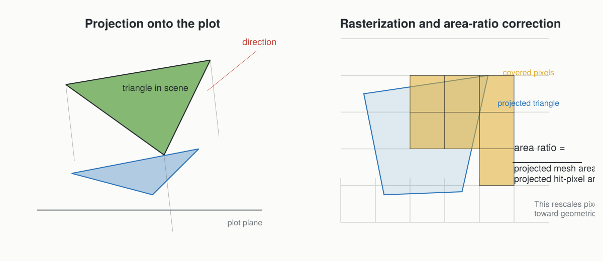

# First-Order Interception

First-order interception is the part of the model that answers one question:

> from each incoming direction, which scene components are actually exposed, and by how much?

This is the `Mir` stage in the historical ARCHIMED documentation.

## Core Hypothesis

The canopy is treated as a set of surfaces, not as a turbid volume.
Each leaf, stem, soil tile, or object contributes through its mesh faces.

That means:

- visibility is geometric
- occlusion is explicit
- the solver works at the level of surfaces and projected areas

## Why Projection Instead Of Full Ray Tracing

ARCHIMED’s efficiency comes from a very specific compromise:

- use a finite number of incoming directions
- assume rays are parallel inside each direction
- project the scene onto the plot
- infer visibility from the ordered hits inside projected pixels

This is much cheaper than general-purpose angular ray tracing, while remaining well matched to natural illumination by sun and sky.

## Pixel Tables

For each direction, the scene is projected onto the plot domain.
The plot is discretized into pixels whose target size is controlled by `pixel_size`.

Each pixel stores:

- the first visible hit
- and, when needed, the lower hits that matter for scattering or sensors

The pixel table is therefore both:

- a visibility structure for first-order interception
- a transfer structure reused later by scattering

When only first-order interception is needed, ArchimedLight follows the historical
ARCHIMED behavior and keeps the upper visible hit for each pixel. This is a
geometric visibility rule: a lower surface does not receive direct light through
an upper surface in this mode, even if the upper surface has a non-zero
`transparency` value.

When scattering, virtual sensors, or light emitters are active, the solver keeps
the full hit stack instead. In that case `transparency` controls how much of the
incoming flux continues down the stack and can therefore affect lower hits.

## The Area-Ratio Correction

Rasterization introduces a known bias: a triangle rarely covers an integer number of pixels exactly.
ARCHIMED compensates with the area-ratio correction.



The idea is:

```text
area ratio = true projected area / hit-pixel area
```

Pixel counts are then rescaled by that factor so the interception estimate stays closer to the true projected geometry.

This correction is one of the defining details of the historical algorithm.

## Toricity During Projection

When `toricity=true`, projected rays that exit the plot re-enter from the opposite side.
The plot behaves like one repeating tile of an infinite canopy.

This is especially important for:

- row crops
- orchards
- repeated plant arrangements

and it is also one of the trickiest areas for exact Java parity, because border pixels must wrap consistently.

## What The First-Order Stage Produces

For each node and waveband, the first-order stage accumulates:

- visible projected area
- hit counts
- intercepted power before scattering

After integration, those become the familiar exported variables:

- `Ri_PAR_0_f`
- `Ri_NIR_0_f`
- `Ri_PAR_0_q`
- `Ri_NIR_0_q`

## Practical Consequences

- smaller `pixel_size` improves geometric fidelity but increases runtime
- `area_ratio=true` is usually the right choice for ARCHIMED-like behavior
- disabling `scattering` still gives a complete and meaningful first-order light budget
- scenes near plot borders are especially sensitive to `toricity`
