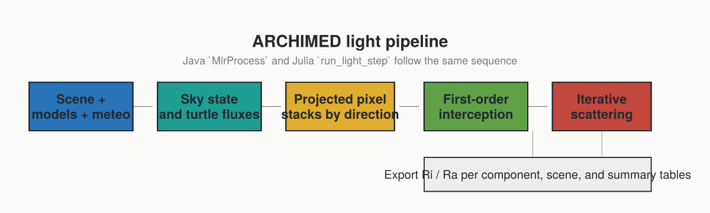

# Pipeline Overview

This page gives the high-level mental model of one ARCHIMED light simulation step.
If you want the mechanics behind projection and scattering, continue with:

- [First-Order Interception](theory_interception.md)
- [Scattering And Optical Assumptions](theory_scattering.md)

## The Big Picture

At each meteo step, ARCHIMED estimates how much radiation each scene component receives and absorbs.
The light-only Julia port keeps the same physical sequence as the historical Java implementation, but exposes it as explicit functions.



## What The Model Represents

The model is surface-based:

- leaves, stems, soil, sensors, and other objects are represented as meshes
- light propagates along a finite set of directions
- visibility is computed by projecting the scene onto the plot
- first-order interception is computed before any scattering
- multiple scattering then redistributes a fraction of the intercepted energy

## One Simulation Step, Narrated

### 1. Read The Forcing

The solver starts from one meteo row or an equivalent sky state:

- date and time interval
- site latitude
- shortwave forcing, either measured or reconstructed

If the meteo step is coarse, the radiative state can be subdivided internally using `radiation_timestep_minutes`.

### 2. Build The Directional Sky

`compute_sky` and `build_turtle` convert the atmospheric forcing into:

- sun position
- direct and diffuse fractions
- directional irradiance carried by turtle sectors and, optionally, an explicit sun direction

### 3. Project The Scene

For each direction:

- the mesh is projected onto the plot
- the projected area is rasterized into pixels
- visible hits and lower hits are ordered along each pixel stack

This is the geometric heart of the ARCHIMED method.

### 4. Compute First-Order Interception

The visible projected area of each component is converted into intercepted power and then later into irradiance and energy.
This is the `Mir` stage in the historical ARCHIMED terminology.

### 5. Optionally Run Scattering

If `options.scattering=true`, the model reuses the ordered hit information to exchange scattered energy between components iteratively.
This is the `MuSc` stage in the historical terminology.

### 6. Integrate And Name The Outputs

`integrate_light` converts powers into the exported quantities:

- `Ri_*`: intercepted radiation
- `Ra_*`: absorbed radiation
- `_f`: fluxes or irradiances
- `_q`: step-integrated energies

## Julia API Correspondence

The pipeline is exposed directly:

```julia
sky = compute_sky(row, options)
turtle = build_turtle(options, sky)
fluxes = compute_directional_fluxes(row, sky, turtle, options)
first = compute_first_order(scene, models, turtle, fluxes, options)
scat = compute_scattering(scene, models, turtle, first, options)
budget = integrate_light(scene, models, first, scat, options; meteo_row=row)
```

Or, in one call:

```julia
step = run_light_step(scene, models, row, options)
```

## Scope Boundary

The archived ARCHIMED manuals describe a larger application family including photosynthesis, stomatal conductance, and energy balance.
Those pages are still useful context for the meaning of PAR, NIR, TIR, or the role of meteo variables, but the package documented here is intentionally limited to the light core.
