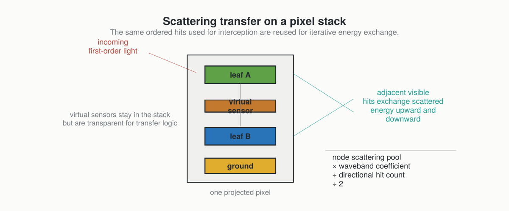

# Scattering And Optical Assumptions

After first-order interception, ARCHIMED can redistribute part of the intercepted energy between scene components through iterative scattering.

This page also summarizes the main optical and modelling assumptions behind the light-only package.

## Scattering In One Sentence

The model takes the energy first intercepted by each component, applies a waveband-specific scattering coefficient, and redistributes that scattered pool between adjacent visible hits along the same pixel-stack geometry used for interception.



## The Main Assumptions

### Surface-Based Scene

The model works on explicit surfaces, not on a continuous participating medium.

### Finite Direction Set

Both incident radiation and scattering exchanges are described over a finite set of discrete directions.

### Simplified Optical Behavior

The optical model is not a full BRDF / BTDF description.
The current light runtime mainly needs waveband-specific scattering fractions, typically one for PAR and one for NIR.

### Lambertian-Style Redistribution

The scattering logic assumes that the scattered pool can be redistributed across the available directional links in a way consistent with the historical ARCHIMED Lambertian simplification.

## Optical Coefficients

In model files, `optical_properties` store scattering factors by waveband:

```yaml
optical_properties:
  PAR: 0.15
  NIR: 0.90
```

Interpreting those values:

- low PAR scattering means most intercepted PAR is absorbed
- high NIR scattering means much more of the intercepted NIR is re-emitted into the scattering process

This matches a classic plant optics intuition: leaves absorb PAR relatively strongly but scatter and transmit much more NIR.

## Artificial Light Emitters

The historical ARCHIMED source formalism can be read with three indices:
source `s`, waveband `b`, and direction `d`. Natural illumination has sources
such as the sun and sky sectors. An artificial emitter adds another source to
that same light budget.

For an emitter, `radiance` is the total emitted magnitude attached to the
emitting component type, and `gamma` partitions that magnitude by waveband. For
example, `gamma.PAR = 0.48` means that 48 percent of the emitted energy is
treated as PAR. Conceptually, the emitted source term for a band is:

```text
I[b, s] = gamma[b, s] * I[s]
```

The Julia runtime treats `LightEmitter` components as Lambertian-style scene
sources. Their emitted light is routed through the same directional visibility
and pixel-stack machinery used by first-order interception, so receivers still
use their usual model semantics: group/type matching, transparency, virtual
sensor behavior, and waveband-specific optical properties. If scattering is
enabled, the emitter-contributed first-order light joins the same scattered
energy pool as sky and sun light.

This is deliberately simpler than a full photometric lamp or point-source ray
tracer. It is an ARCHIMED-compatible source term for artificial illumination,
controlled experiments, and diagnostic scenes.

## How One Scattering Iteration Works

For each node and band:

1. start from the current intercepted or previously scattered energy
2. multiply by the node scattering coefficient
3. divide by the number of relevant directional hits
4. split upward and downward transfer symmetrically
5. accumulate received scattered energy on neighboring visible hits

The process repeats until the remaining scene-scale scattered energy becomes small enough.

## Stopping Rule

The historical ARCHIMED stopping rule is empirical but practical:

```text
current scattered energy <= scattering_stop_ratio × initial scene intercepted energy
```

The default `scattering_stop_ratio = 0.01` means the iteration stops once the remaining scattering pool falls below 1 percent of the initial intercepted energy in the band.

## Virtual Sensors

Virtual sensors are special:

- they receive light
- they can report it
- they do not behave as opaque absorbing geometry
- they remain transparent in the scattering transfer logic

That is why they matter both for model semantics and for the choice of pixel-stack depth.

## Soil And Ground Matter More When Scattering Is Enabled

Without ground geometry, a significant part of the lower-canopy exchange can be missed.
That is why the historical ARCHIMED workflows often recommend paving or explicit ground tiles whenever scattering is active.

## Where The Julia Port Differs Structurally

The Java code stored much of the scattering state directly in mutable per-node objects.
The Julia port keeps the same model semantics, but represents the transfer logic through explicit containers such as:

- first-order results
- scattering transfer graphs
- scattering result objects
- final `LightBudget`

The physical story stays the same even though the software architecture is more data-oriented.
